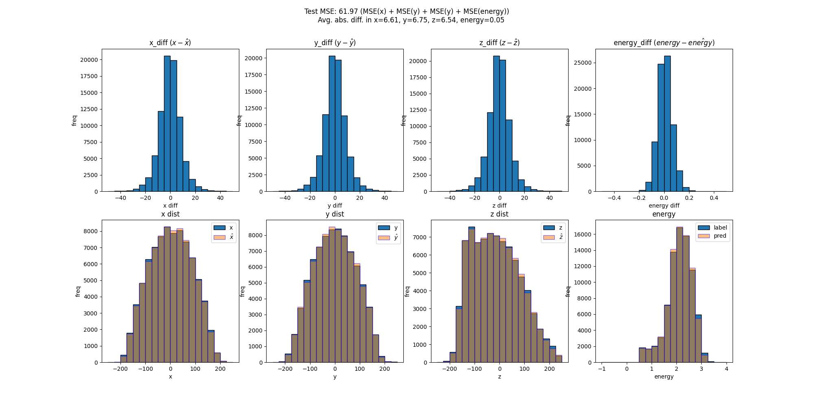

**Steps:**

0. Download data from `https://drive.google.com/file/d/1F_ZjeqmKkpWNXyd9JD-zty2SNe95TlUz/view?usp=sharing`
1. Add data called `train_X_y_ver_all_xyz_energy.pt` into `/data` folder
2. Install packages `pip install -r requirements.txt` (Not extensively tested. Let Eugene know if libraries seem to mismatch)
3. run `. multiple_exp.sh` (edit bash file configuration such as adding `--debug` to run **sample** of data)
4. See if you can replicate example plots below

**Notes:**
- Full training should take ~15 min (based on 4 x A5000), 1:10 hr for single A5000.
- This code is agnostic of device (gpu, cpu, multi-gpu)
- Training log will be printed in `"nohup.out"` & `f"{ver}/train.txt"`

**Example Plots:**
(see if you can replicate them)

**1. XL Debug**

command: `nohup accelerate launch train.py --use_wandb --epochs 600 --enc_dropout 0 --dec_dropout 0.1 --weight_decay 5e-3 --lr 1e-3 --save_ver XL \
                      --seed 999 --dim_reduce_factor 2 --batch_size 256 --scale_energy_loss 1000 --conv2lin --debug`

**2. XL**

command:  `nohup accelerate launch train.py --use_wandb --epochs 600 --enc_dropout 0 --dec_dropout 0.1 --weight_decay 5e-3 --lr 1e-3 --save_ver XL \
                      --seed 999 --dim_reduce_factor 2 --batch_size 256 --scale_energy_loss 1000 --conv2lin`
                      

